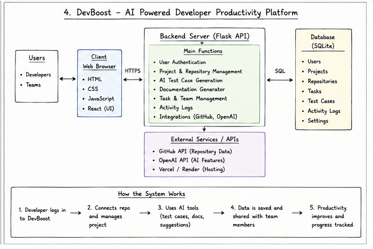

# DevBoost — AI-Powered Developer Productivity Platform

Developed for **Future Ready Hackathon 2025**.

DevBoost is a developer productivity platform designed to support developers with repository management, documentation generation, AI-assisted test creation, task collaboration, and activity tracking in one application.

## Problem

Software development teams often work across multiple repositories, documentation tools, testing workflows, and task-management platforms. This can lead to:

- Frequent context switching
- Outdated or missing documentation
- Gaps in test coverage
- Reduced collaboration efficiency

## Solution

DevBoost centralizes key developer workflows by providing:

- User authentication
- Project and repository management
- AI-assisted test case generation
- Documentation generation
- Task and team management
- Activity logging
- GitHub repository integration
- AI-powered developer assistance

## Tech Stack

- **Frontend:** React, HTML, CSS, JavaScript
- **Backend:** Python, Flask API
- **Database:** SQLite
- **Integrations:** GitHub API, OpenAI API
- **Deployment:** Vercel / Render

## Architecture

## Team

Developed by UCSI University students for **Future Ready Hackathon 2025**.

- **Durghaashini S Ragunathan — Team Lead**
- Eng Jia Xuan
- Terence Ling Chee Yew

## Documentation

📄 [Project Notes](docs/project-notes.md)

## How It Works

1. Developer logs in to DevBoost.
2. Connects a repository and manages the project.
3. Uses AI tools for test cases, documentation, and suggestions.
4. Project data and activity are saved and shared with team members.
5. Productivity and progress can be tracked.

## Project Context

DevBoost was developed as a functional hackathon prototype focused on demonstrating an integrated developer-productivity workflow within a limited development period.
